# Initial Setup

If already done, skip to the next section [Basic Usage](#basic-usage).

1. Download and extract the latest SSE-AT Release to a folder like this: C:\Modding\Tools\SSE-AT\
   - in case of an update, just overwrite the existing files there
2. Optional: Add the SSE-AT.exe as Tool to Vortex or MO2
3. Download and install the Dynamic String Distributor SKSE Plugin as a mod (position does not matter)
4. Run the SSE-AT.exe
5. Click on *Next*, choose the language you want to play with and login to Nexus Mods via Browser

 
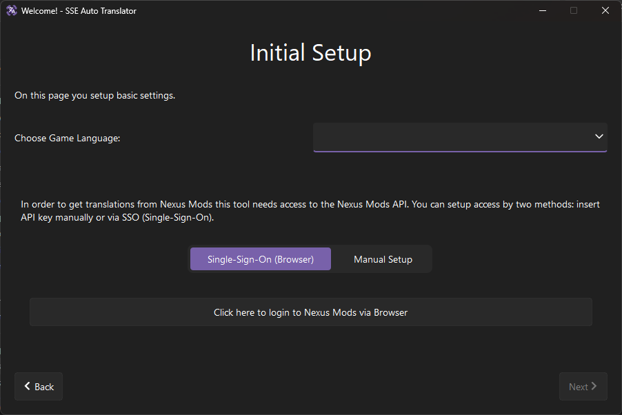

6. Click on *Next* when you're done

7. Select your mod manager and the instance/profile you want to load. You can always change the loaded instance and mod manager under *Settings* > *User Settings*.

 
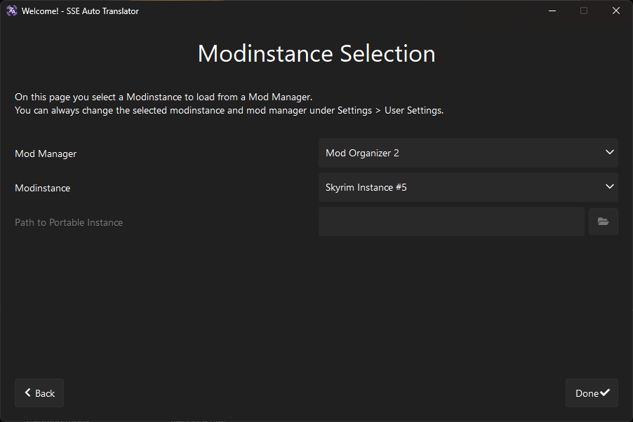

If you want to load a portable MO2 instance you also have to insert the installation path of MO2 (the folder where ModOrganizer.exe is)

 
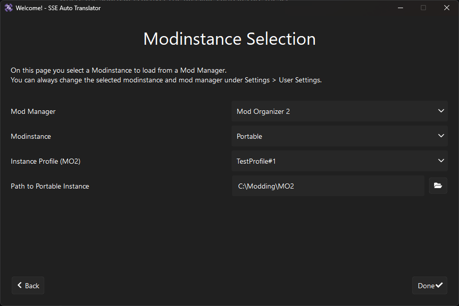

Click on *Done* and you're ready to go!

## Setting up Translator API

If you have an DeepL API Key that you want to use, you can setup the DeepL API under *Settings* > *Translator API Settings*.

 
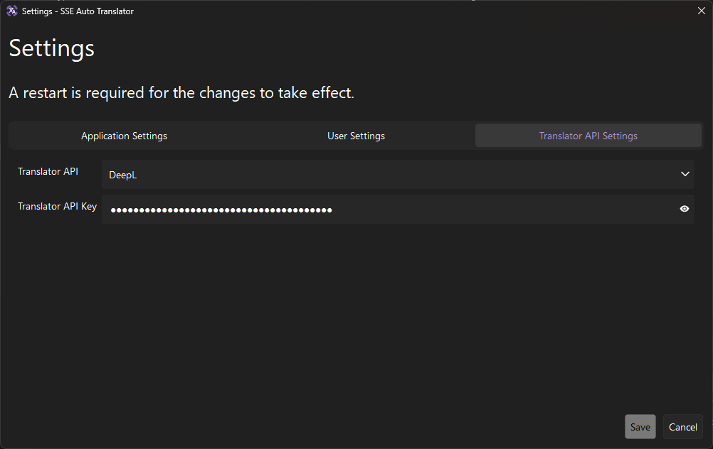

# Basic Usage

To translate a modlist with all translations that are either Vanilla or available at Nexus Mods, follow the steps below.

1. Start the SSE-AT.exe
   - If this is the first start, see [Initial Setup](#initial-setup) above
2. Run the modlist scan (button 1, see below)
3. Run the Nexus Mods scan (button 2, see below)

Scans are finished when this dialog pops up.

 
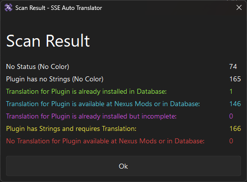

4. Download and install available Translations (button 3, see below)

 
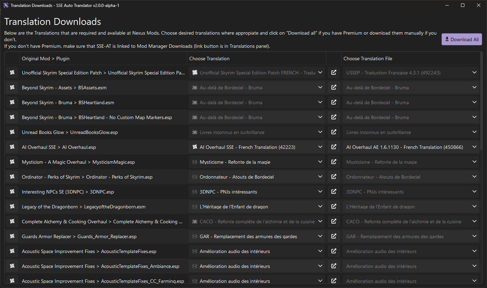

5. Build the Output for the Dynamic String Distributor SKSE Plugin (button 4, see below)
   - **This must be done everytime after you edited, installed or deleted a translation**

 
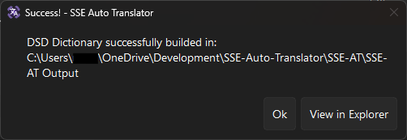

6. Install the Output folder as a mod (modlist position does not matter) so that the "SKSE" folder lands in the game's "Data" folder

Now you're ready to play!

# Advanced Usage and Overview of the GUI

## Main Page

 
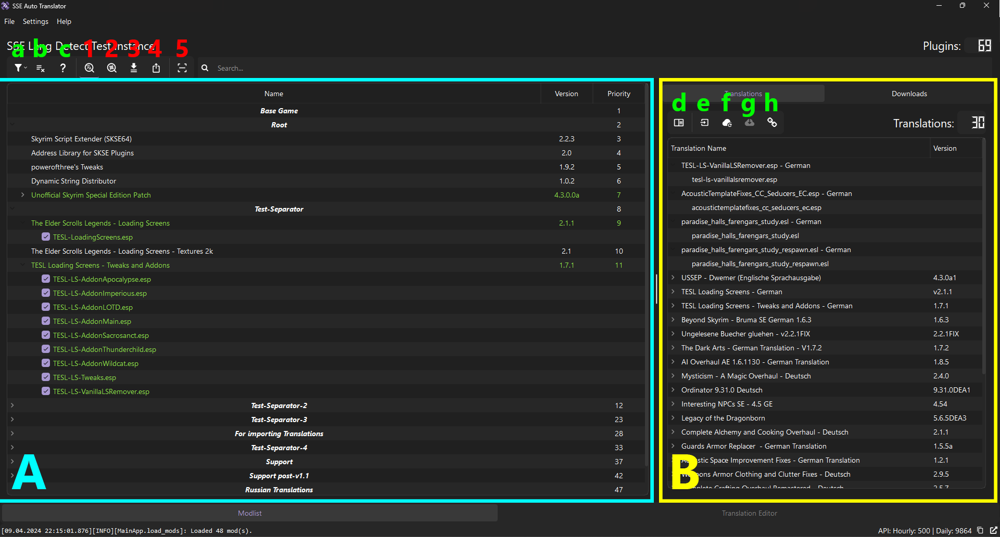

### A: Modlist panel, shows Mods and their Plugins with their respective Status.

**a**: Filter button, to filter for a specific Status

**b**: Ignore List button, opens a dialog showing all Plugins that are in the Ignore List (see below for more information)

**c**: Help button, opens a dialog showing the different Status and their colors

More features are available when right-clicking on one or more Plugins/Mods.

### B: Database panel, shows installed Translations and the Plugins they cover

**d**: Displays base game strings in a String List dialog (see below). Those can then be taken as reference when creating new translations.

**e**: Import button, to import a translation from a local file (or multiple when selected). The import supports downloaded mods from Nexus Mods (.rar, .7z, .zip), Plugins (.esp, .esm, .esl), DSD Translations (.json) and exported xTranslator translations (.xml).

**f**: Link button, to link SSE-AT to Mod Manager Downloads on Nexus Mods, primarily used for non-Premium downloads. When exited regularly, SSE-AT unbinds itself and binds the app that was previously bound to Mod Manager Downloads. A crash might prevent this, so that SSE-AT stays bound. In this case you have to link your Mod Manager again.

More features are available when right-clicking on one or more Plugins/Translations.

### Main Features

**1**: Scans Modlist for required and installed Translations

**2**: Scans Nexus Mods for available Translations

**3**: Downloads available Translations from Nexus Mods and creates Translations that are completely covered by the Database (already installed Translations)

**4**: Builds the Output folder for the SKSE Plugin (Dynamic String Distributor) that must be installed as mod in order to replace the strings ingame.

**5**: Scans database for incomplete translations. This scan take a while depending on the number of installed translations. (Experimental)

### Ignore List

Plugins can be added to an Ignore List that completely excludes them from any functionality. They can be added by a right click on them in the Modlist panel (see above).

 
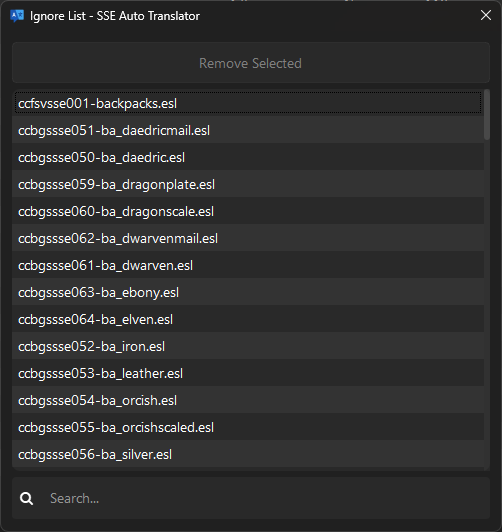

## Translation Editor

The SSE-AT has an inbuilt Editor for creating new translations or editing already existing ones. Translations cannot be exported or applied to Plugin files (.esp, .esm, .esl) like with other Translators (for eg. xTranslator or ESP-ESM Translator) but only to the new DSD Format.

 
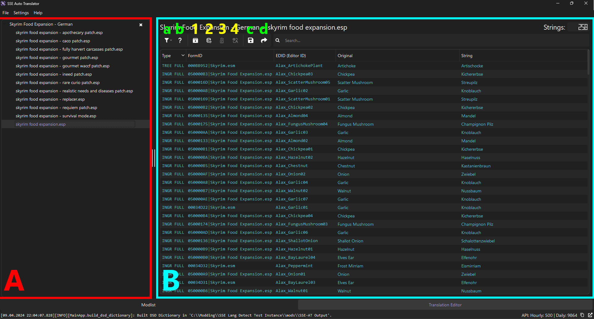

**A**: Side-Menu, shows open Translations and Plugins. Here you can close translations that you are done working on.

**B**: Main Panel, shows Strings with their EditorID / FormID, Type (Record and Subrecord) and their Original String.

**a**: Filter button, to filter for a specific Status

**b**: Help button, opens a dialog showing the different Status and their colors

**1**: Attempts to translate untranslated string using Database of installed Translations

**2**: Opens a *Search and Replace* Dialog for selected strings

 
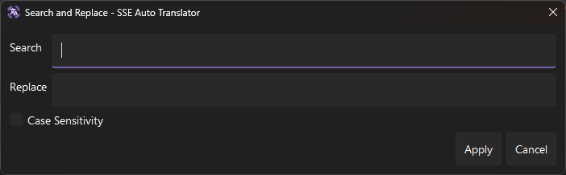

**3**: Translates selected strings using selected Translator API (configurable in *Settings*)

**c**: Saves changed translation to database

**d**: Export button for exporting the translation to publish it.

More features are available when right-clicking on one or more Strings.

### Editing Strings

At time of writing, only editing of single strings is implemented and working.
Batch editing (search and replace) and automated translation with Google Translator are planned to be implemented in the near future.

A string can be edited by either double-clicking on it or right click > Edit String.

 

**A**: Text Box with Original String, readonly

**B**: Text Box with Translated String, here you edit the String

**a**: Information Label about String, displays EditorID (or FormID in case of Dialogues), Type (Record and Subrecord) and Index (if existing, mostly for dialogues and quests)

**1**: Translates String with configured Translator API

# String List

You can always display the strings of a Plugin or Translation by right-clicking in a separate dialog for either debugging or referencing for new/other Translations.

 
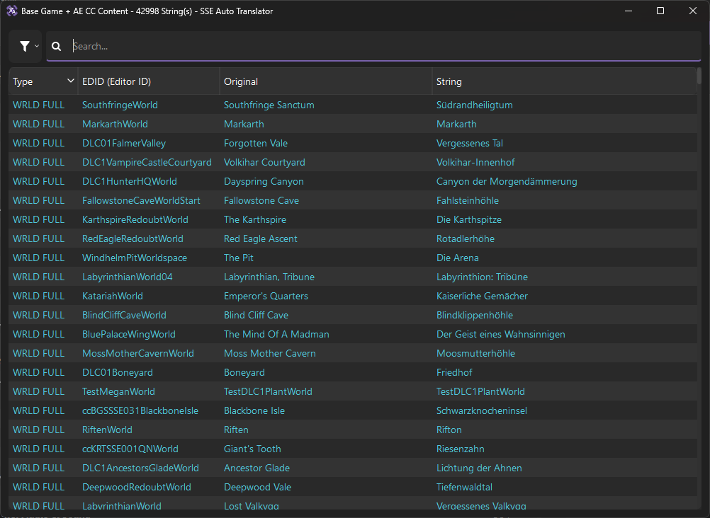
