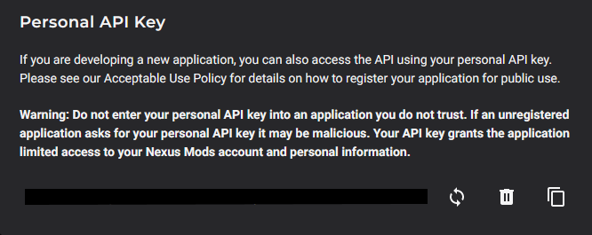
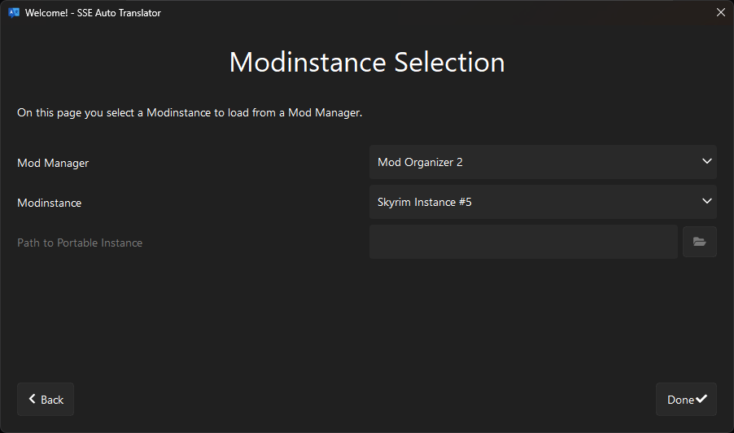
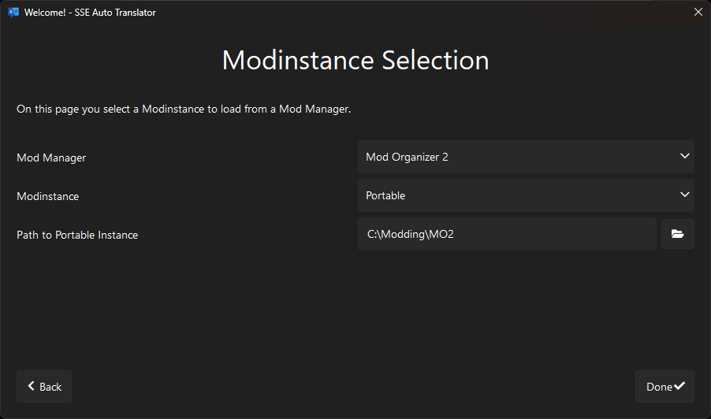
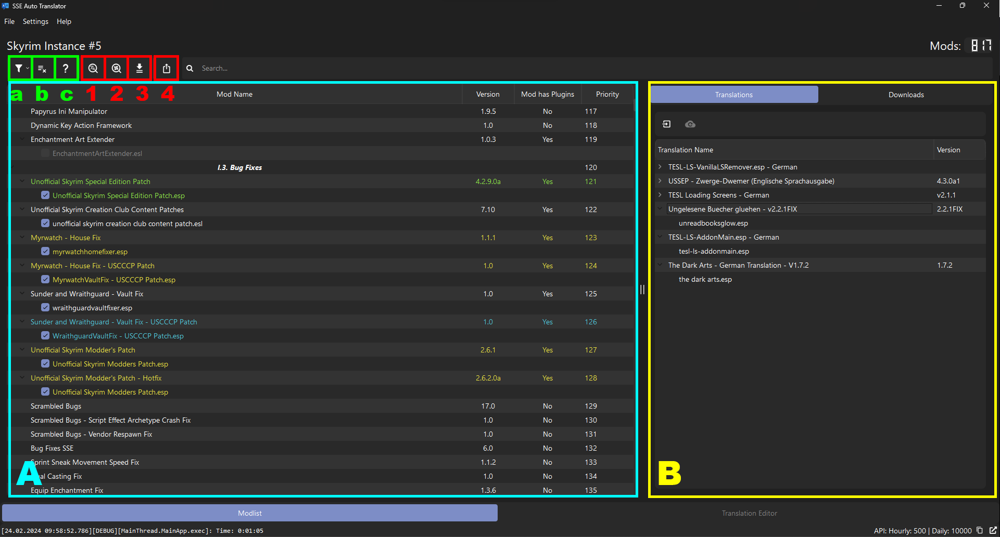
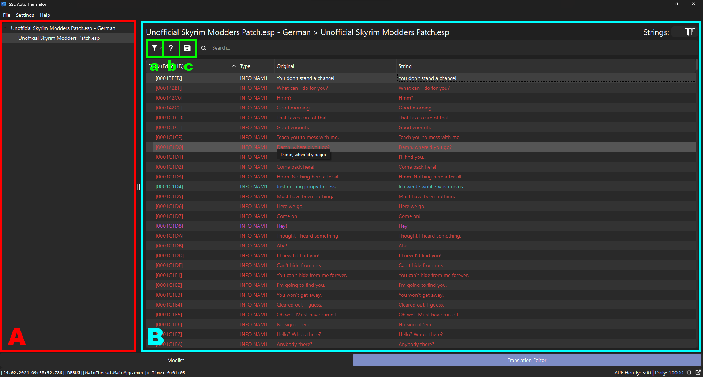
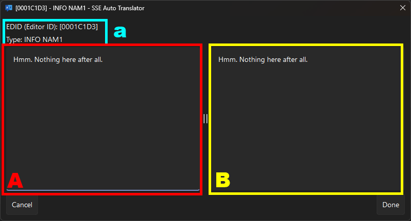

# Initial Setup

If already done, skip to the next section *Basic Usage*.

1. Download and extract the latest SSE-AT Release to a folder like this: C:\Modding\Tools\SSE-AT\
   - (in case of an update, just overwrite the existing files there)
2. Add the SSE-AT.exe as Tool to Vortex or MO2
3. Download and install the Dynamic String Distributor SKSE Plugin (Debug or Release Build, choice is yours) as a mod (position does not matter)
4. Run the SSE-AT.exe
5. Click on *Next*, choose the language you want to play with and enter your personal API Key

 

Go to [Site Preferences at Nexus Mods](https://next.nexusmods.com/settings/api-keys) and scroll to the bottom until you see this:

 

Click on "Generate" if there is no API Key and copy it.

Enter it in the API Key field and click on *Check API Key*.

 

If the key is valid (which it should be if you copied it correctly) you can click on *Next*.

6. Select your mod manager and the instance / profile you want to load.

 

If you want to load a portable MO2 instance you also have to insert the installation path of MO2 (the folder where ModOrganizer.exe is)

 

Click on *Done* and you're ready to go!

# Basic Usage

To translate a modlist with all translations that are either Vanilla or available at Nexus Mods, follow the steps below.

1. Start the SSE-AT.exe
   - If this is the first start, see *Initial Setup* above
2. Run the modlist scan (button 1, see below)
3. Run the Nexus Mods scan (button 2, see below)
4. Download and install available Translations (button 3, see below)
5. Build the Output for the Dynamic String Distributor SKSE Plugin (button 4, see below)
6. Install the Output folder as a mod (modlist position does not matter) so that the "SKSE" folder lands in the game's "Data" folder

Now you're ready to play!

# Advanced Usage and Overview of the GUI

## Main Page

 

**A**: Modlist panel, shows Mods and their Plugins with their respective Status.

**B**: Database panel, shows installed Translations and the Plugins they cover

**a**: Filter button, to filter for a specific Status

**b**: Ignore List button, opens a dialog showing all Plugins that are in the Ignore List (see below for more information)

**c**: Help button, opens a dialog showing the different Status and their colors

### Main Features

**1**: Scans Modlist for required and installed Translations

**2**: Scans Nexus Mods for available Translations

**3**: Downloads available Translations from Nexus Mods and creates Translations that are completely covered by the Database (already installed Translations)

**4**: Builds the Output folder for the SKSE Plugin (Dynamic String Distributor) that must be installed as mod in order to replace the strings ingame.

### Ignore List

Plugins can be added to an Ignore List that completely excludes them from any functionality. They can be added by a right click on them in the Modlist panel (see above).

 

## Translation Editor

The SSE-AT has an inbuilt Editor for creating new translations or editing already existing ones. Translations cannot be exported or applied to Plugin files (.esp, .esm, .esl) like with other Translators (for eg. xTranslator or ESP-ESM Translator) but only to the new DSD Format.

 

**A**: Side-Menu, shows open Translations and Plugins

**B**: Main Panel, shows Strings with their EditorID / FormID, Type (Record and Subrecord) and their Original String

**a**: Filter button, to filter for a specific Status

**b**: Help button, opens a dialog showing the different Status and their colors

**c**: Saves changed translation to database

### Editing Strings

At time of writing, only editing of single strings is implemented and working.
Batch editing (search and replace) and automated translation with Google Translator are planned to be implemented in the near future.

A string can be edited by either double-clicking on it or right click > Edit String.

 

**A**: Text Box with Original String, readonly

**B**: Text Box with Translated String, here you edit the String

**a**: Information Label about String, displays EditorID (or FormID in case of Dialogues) and Type (Record and Subrecord)
